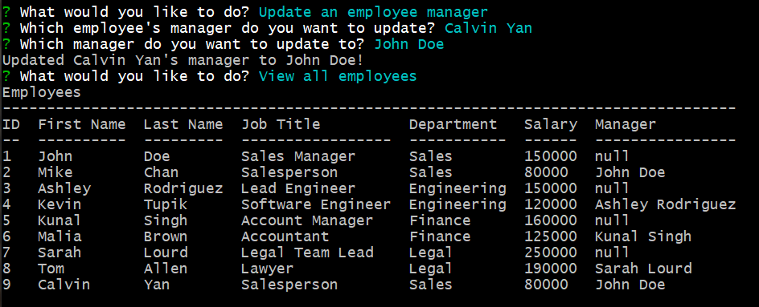
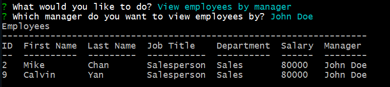
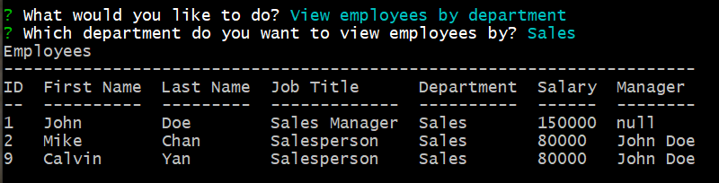

# Employee-Tracker

## Description

Content Management System helps user to manage the company's employee database. 

## Table of Contents

* [Installation](#installation)
* [Usage](#usage)
* [Features](#features)
* [Credits](#credits)
* [Results](#results)
* [Screenshots](#screenshots)

## Installation

To install necessary dependencies, run the following commands:
npm i

## Usage

To use the application, run the following commands:
node index

## Features

1. View departments, roles, employees table
2. Add departments, roles, employees to database
3. Update employee's role & manager
4. View employee table by manager or by department
5. Delete departments, roles, employees from database
6. View total utilized budget

## Credits

Third-Party Assets:
1. inquirer
2. MySQL2
3. console.table

## Results

Video Link: https://watch.screencastify.com/v/MECX7vz06htdetlvLHn7

Repository: https://github.com/pc611652003/Employee-Tracker

## Screenshot

The application will be launched by using command 'node index'.
User will be display a list of action to choose from.

After user choose "View all departments", application will display a table of all department in the company.

After user choose "View all roles", application will display a table of all roles in the company, along with the salary of the role, and the department the role belonged to.

After user choose "View all employees", application will display a table of all employees in the company, along with their salary, role, department.

After user choose "Add a department", user will be ask to input the name of the department, then the new department will be added to the database.

After user choose "Add a role", user will be ask to input the name of the role, the salary of the role and the department it belongs to, then the new role will be added to the database.

After user choose "Add an employee", user will be ask to input the first and last name of the employee, employee's role and manager, then the new employee will be added to the database.

After user choose "Update an employee role", user will be ask to choose an employee and choose a new role, then the employee's info will be updated.

After user choose "Update an employee manager", user will be ask to choose an employee and choose another employee to be the manager to report to, then the employee's info will be updated.

After user choose "View employees by manager", user will be ask to choose a manager, then application will display all employees reporting to the chosen manager.

After user choose "View employees by department", user will be ask to choose a department, then application will display all employees belong to the chosen department.

After user choose "Delete an employee", user will be ask to choose an employee, then the employee will be deleted from database. Employees reporting to that employee will now report to no one.

After user choose "Delete a role", user will be ask to choose a role, then the role will be deleted from database. Employees with that role will now have no role.

After user choose "Delete a department", user will be ask to choose a department, then the department will be deleted from database. Roles that belong to the department will now belong to nothing.

After user choose "View total utilized budget of a department", user will be ask to choose a department, then the application will display the total cost of the department.

Finally, after user choose "Exit", user will exit the application.
